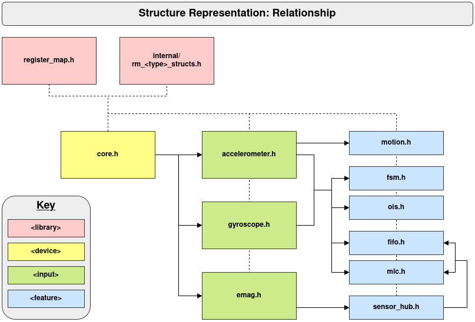

# ism330dhcx
ISM330DHCX Driver


## Features


### Structure Representation

 * Core (device controls)
 * Register Mapping
 * Accelerometer
 * Gyroscope
 * External Magnetometer
 * First In / First Out (FIFO)
 * Finite State Machine (FSM)
 * Machine Learning Core (MLC)
 * Optical Image Stabalisation (OIS)
 * Motion Detection
 * Sensor Hub


#### Diagram



## Install

### Prerequisites
- CMake (version 3.16 or higher)
- C compiler (e.g., GCC)

### Build and Install

1. Clone the repository:
   ```bash
   git clone <repository-url>
   cd ism330dhcx
   ```

2. Build the library:
   ```bash
   cmake -S . -B build
   cmake --build build
   ```

3. Install the library and headers (requires sudo for system-wide installation):
   ```bash
   sudo cmake --install build --prefix /usr/local
   ```

This installs the static library to `/usr/local/lib/libism330dhcx.a` and headers to `/usr/local/include/ism330dhcx/`.

### Alternative: Install to User Directory (No sudo required)
If you prefer not to use sudo, install to a local directory:
```bash
cmake --install build --prefix ~/local
```
Then, when compiling your application, use:
```bash
gcc your_program.c -I ~/local/include -L ~/local/lib -lism330dhcx -o your_program
```
